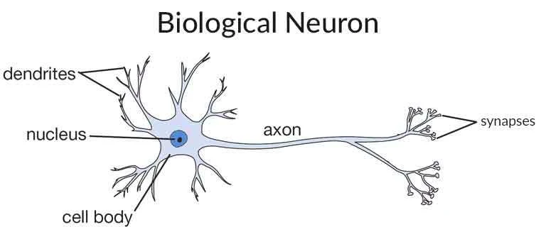
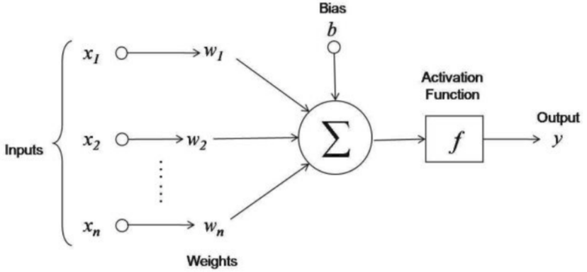
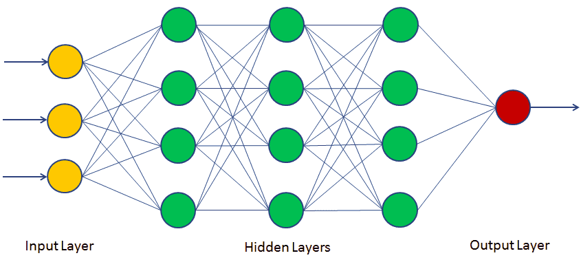
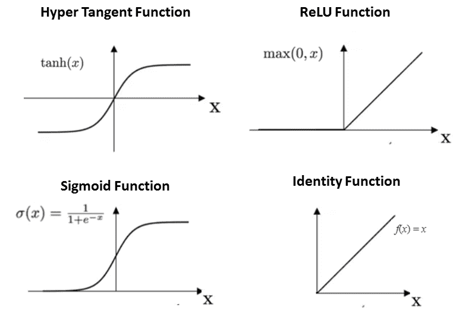

```{r setup, include=FALSE}
knitr::opts_chunk$set(echo = TRUE)
```


# Neuronales Netz Modell in R

## Allgemeines

Ein neuronales Netz (ANN - Artificial Neuronal Network) anhand bestehender Beispiele zu lernen. ein ANN ist ein Informationsverarbeitungsmodell, welches vom biologischem Neuronensystem inspiriert ist. Es besteht aus einer Vielzahl an miteinander verbundenen Verarbeitungselementen, welche als Neuronen bezeichnet werden. Ein neuronales Netz ist ein komplexes adaptives (=> interne Struktur mittels Gewichte und Inputs veränderbar) System. 

Neuronale Netze wurden entwickelt um Problemstellungen zu lösen, welche für Menschen einfach aber für Maschinen schwierig zu lösen sind, zbB. die Erkennung und Klassifizierungen von Bildern. Solch gelagerte Problemstellungen werden als Problem der Mustererkennung ("Pattern Recognition") eingestuft. Anwendungen dazu sind zB optische Zeichenerkennung und Erkennung von Objekten.

##Einführung in neuronale Netze
Ein Neuron ist eine simple Zelle innerhalb eines neuronalen Netzes(NN) welches einen Input entgegennimmt, diesen verarbeitet und diesen ausgibt. 

Der Algirthmus neuronaler Netze ist inspiriert von der Funktionsweise des menschlichen Gehirns um bestimmte Aufgaben zu erledigen. Ein NN führt Berechnungen mittels Lernprozesse durch. Das neuronale Netz besteht aus verbundenen Ein- und Ausgabeeinheiten, wobei jeder Verbindung eine Gewichtung zugeordnet ist. Während des Lernprozesses lernt das neuroanle Netz durch Anpassung dieser Gewichtungen um zB. die richtige Klassenbezeichnung von EIngabedaten zu ermitteln.

Das menschliche Gehirn besteht aus Milliarden von Nervenzellen, welche Informationen verarbeiten. Jede neuronale Zelle ist ein einfaches Verarbeitungssystem. Ds miteinander verbundene Netz an Neuronen überträgt Informationen mittels elektrischer Signale. Neuronen empfangen Signale anderer Neuronen. Basierend auf diesen Informationen werden erfolgt eine Verarbeitung und dessen Output wird wiederum an andere Neuronen weitergeleitet.



Dendriten empfangen Signale von anderen Neuronen. Der Zellenkörper summiert alle Eingangssignale, um eine Ausgabe zu erzeugen. Wenn die Summe der Eingangssignale einen gewissen Schwellenwert erreicht, wird die Ausgabe über das Axon weitergeleitet.Synapsen dienen zur Interaktion von Neuronen. Sie senden elektrische oder chemische Signale an ein anderes Neuron.

Im Vergleich dazu wird folgend ein Neuron eines neuronalen Netzes dargestellt.


Hier sind x1,x2,...,xn die Eingangsvariablen  und w1,w2,...,wn sind die Gewichtungen zu den einzelnen Variablen. b ist der Bias welcher gemeinsam mit den Eingängen den Gesamtinput darstellt. Der Bias und die Gewichtungen sind anpassbare Pararmeter des Neurons. Im Zuge des Lernprozesses werden diese Parameter angepasst. Die Ausgabe eines Neurons kann von -inf bis +inf reichen, da das Neuron keine Grenze kennt. Es wird daher ein Mapping zwischen dem INput un dem Output benötigt. Dieser Mechanismus des Mappings wird als Aktivierungsfunktion bezeichnet.

## Feedforward und Feedback Netze
Bei künstlcih neuronalen Netzen gibt es zwei Hauptarten, Feedforward unf Feedback. Die Feedforward-Netze ist nicht rekursiv. Neuronen einer Schicht sind nur mit Neuronen nachfolgender Schichten verbunden und bilden daher keinen Zyklus. In Feedforward-Netzen wandern die Signale nur Richtung "Output Layer". 

Feedback-Netze enthalten Zyklen. Signale bewegen sich mittels Schleifen in beide Richtungen. Feedback-Netze sind auch bekannt als "Recurrent Neuronal Networks".



## Aktivierungsfunktionen

Die Aktivierungsfunktion bestimmt den internen Zusatnd und definiert die Ausgabe eines Neurons. Die Ausgabefunktion berechnet dementsprechendden tatsächlichen Ausgabewert. Es gibt verschiedene Aktivierungsfunktionen. Einige davon sind folgend dargestellt:

* __Identity function__: Diese Funktion bildet die Eingabe auf denselben Ausgabewert ab. Es handelt sich also um einen linearen Operator im Vektorraum, auch bekannt als geradlinige Funktion bei der die Aktivierung proportional zur Eingabe ist. 

* __Binary Step Function__: Wenn der Wert über einen bestimmten Schwellenwert liegt ist die Ausgabe "true" (oder aktiviert). Wenn der Wert unterhalb liegt ist die Ausgabe "false" (oder nicht aktiviert). Diese Funktion wird oft bei Klassifizierungen verwendet

* __Sigmoid Function__: Die Sigmoid Funktion wird auch S-förmige Funktion genannt. Logistische und hyperbolische Tangensfunktionen werden häufig als Sigmoidfunktionen verwendet. Es gibt zwei Arten:
    1. __Binary Sigmoid Function__: Ist eine logistische Funktion wobei der Ausgabewert entweder binär ist oder zwischen     0   und 1 liegt.
    2. __Bipolar Sigmoid Function__: Ist eine logistische Funktion wobei der Ausgabewert zwischen -1 und 1 liegt. Auch       als   hyperbolische Tangensfunktionen bekannt 

* __Ramp Function__: Der Name der Rampenfunktion wird vom Aussehen des Graphen abgeleitet. Sie bildet negative Eingänge auf 0 und positive Eingänge auf denselben Ausgangswert ab.

* __ReLu__: (= redtified linear unit) steht für gleichgerichtete lineare Einheit und ist die am häufigsten verwendete Aktivierungsfunktion der Welt. Sie gibt 0 für negative Werte von x aus.



## Implementierung eines neuronalen Netzes in R

### Packages installieren
```{r }
#install.packages("neuralnet")
```

Es wird folgend ein eigeneer Datensatz erstellt. Es werden zwei Arten von Attributen benötigt. Features und ein Label. In den folgenden Daten gibt es zu jeden Studenten die beiden Features technische Fähigkeiten und kommunikative Fähigkeiten mit einem Wert zwischen 0 und 100. Das Label zeigt ob der Student für den Kurs akzeptiert wurde oder nicht. 

### Trainingsdaten erstellen
```{r}
# Trainingsdaten
TKS=c(20,10,30,20,80,30)
CSS=c(90,20,40,50,50,80)
Placed=c(1,0,0,0,1,1)
# Dataframe erstellen
df=data.frame(TKS,CSS,Placed)
head(df)
```

Mittels der neuralnet Bibliothek wird folgend ein NN Klassifizierer gebildet.

Der Klassifizierer wird gebildet indem die Argumente für Label, Features, Daten, Anzahl an Neuronen im Hidden Layer und Fehlerberechnung übergeben werden.

```{r }
#Bibliothek laden
require(neuralnet)

#Training des neuronalen Netzes
nn=neuralnet(Placed~TKS+CSS,data=df, hidden=3,act.fct = "logistic",linear.output = FALSE)

#Placed~TKS+CSS, Placed is label and TKS and CSS are features.
#df is dataframe,
#hidden=3: represents single layer with 3 neurons respectively.
#act.fct = "logistic" used for smoothing the result.
#linear.ouput=FALSE: set FALSE for apply act.fct otherwise TRUE

```


### Plotten des neuronalen Netzes

```{r echo=TRUE}

plot(nn)

```

### Testdaten erstellen
```{r}
#Testdaten
TKS=c(30,40,85)
CSS=c(85,50,40)
test=data.frame(TKS,CSS)
```

### Ergebnis für Testdaten ermitteln
Wahrscheinlichkeitswerte für die Testdaten ermitteln

```{r}
predict=compute(nn, test)
predict$net.result
```

Konvertierung der Wahrscheinlichkeiten zur binären Klasse
```{r}
prob <- predict$net.result
pred <- ifelse(prob>0.5,1,0)
pred
```

## Vor- und Nachteile
Neuronale Netzwerke sind flexibler und können sowohl bei Regressions- als auch bei Klassifizierungsproblemen verwendet werden. Neuronale Netze eignen sich besonders für nichtlineare Daten mit einer großen Anzahl an EIngaben wie zB Bilder. Neuronale Netzwerke können mit einer beliebigen Anzahl von Eingängen und Layern arbeiten. 

Alternative Algorithmen sind Support Vector MAchines, Decision Tress und Regressionen die simpel, schnell und einfach zu trainieren sind. Oft liefern diese sogar bessere Resultate. Neuronale Netze sind eine Art Black Box die mehr Entwicklungszeit, Rechenpower und Trainingsdaten ebnötigen. NNs können nur für nummeische Daten und Daten ohne fehlende Werte verwendet werden. 
Aussage: "Ein neuronales Netzwerk ist der zweitbeste Weg, um ein Problem zu lösen. Der beste Weg ist, das Problem tatsächlich zu verstehen."

## Use-Cases für neuronale Netze

* __Pattern Recognition__: Neuronale Netzwerke eignen sich sehr gut für Mustererkennungsprobleme wie Gesichtserkennung, Objekterkennung, Fingerabdruckerkennung, etc.

* __Anomaly Detection__:  sie können leicht die ungewöhnlichen Muster erkennen, die nicht in das allgemeinen Muster der Daten passen ermitteln.

* __Time Series Prediction__: Neuronale Netze können für Zeitreihenprobleme verwendet werden wie Aktienkurse oder das Wetter vorherzusagen.
* __Natural Language Processing__: Neuronale Netze bieten eine breite Palette an Anwendungsmöglichkeiten im Bereich des Natural Language Processing, zB. Textklassifizierung, Part-of-Speech Tagging, Spracherkennung und Rechtschreibprüfung.


Source(https://www.datacamp.com/community/tutorials/neural-network-models-r)
