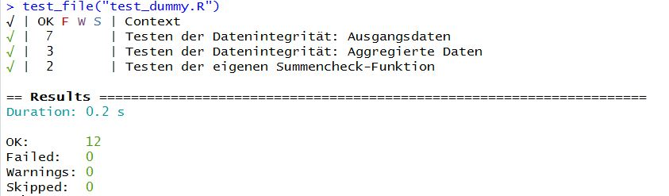
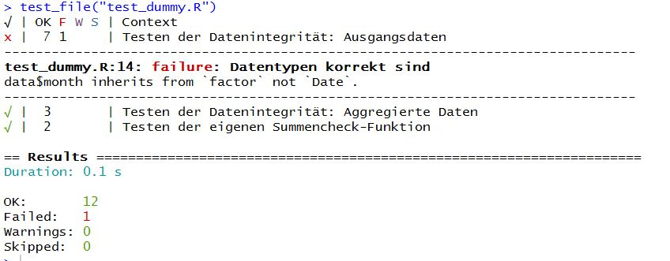
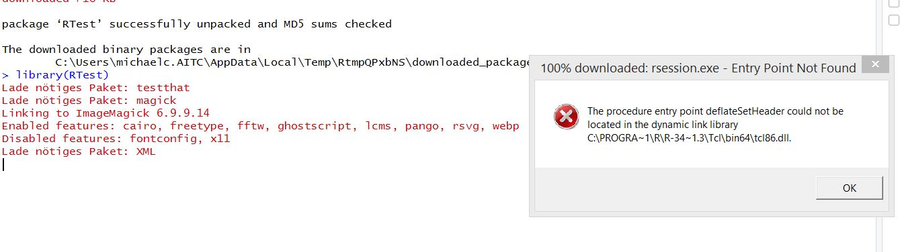
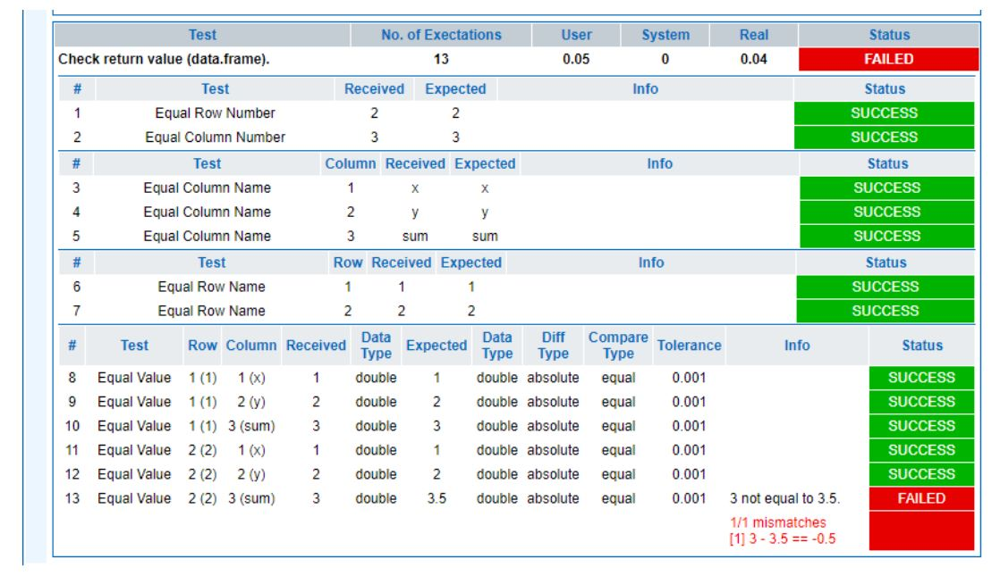

## Allgemeines
Das Testen von Softwarekomponenten ist ein essentieller Teil im Zuge der Softwareentwicklung, der jedoch aufgrund des zu Beginn nicht ersichtlichen Mehrwertes und Aufwand vernachlässigt wird. __testthat__ ist ein für R entwickeltes Framework welches das Schreiben von Tests und dessen Integration in den bestehenden Entwicklungsprozess erleichtert. 

## Einführung
Für die Entwicklung von Tests stellt __testthat__ folgende Funktionen zur Verfügung:

* Funktionen welche den Zweck einer Funktion beschreiben, inklusive Abfangen von Fehlern, Warnungen und Meldungen.
* Einfache Integration in den bestehenden Workflow, mittels Ausführen der Tests in der Command Line oder der Integration in bestehende Skripte.
* Automatische erneute Ausführung von Testfällen bei Änderungen im Code oder der Testfälle an sich.
* Visuellle Darstellung der einzelnen Testschritte.

## Vorteile von testthat
Andere Packages zum Schreiben von Testfällen setzen einen relativ hohen Aufwand an Vorarbeiten voraus um Testfälle zu generieren. Ein Vorteil von testthat ist, dass der Initialaufwand zum Schreiben dieser relativ gering ist. Ein weiterer Vorteil ist die Wiederverwendbarkeit und Integration von Testfällen. Bisher nur visuell und manuell durchgeführte Tests können in den bestehenden Programmcode zur automatischen Überprüfung integriert werden. 

## Teststruktur
"testthat" hat eine hierarchische Struktur bestehend aus __expectations__, __tests__ und __context__:

* __Expectation__ beschreibt wie das Ergebnis einer Berechnung auszusehen hat. Sind die korrekten Werte und Klassen vorhanden? Werden Fehlermeldungen erzeugt bei abweichenden Ergebnissen?
* __Tests__ gruppieren mehrere "Expectations" zum Testen einer Funktion, oder Abhängigkeiten mehrerer Funktionen zueinander.
* __Context__ fasst mehrere Tests zusammen

##Expectations im Detail
Eine Expectation ist das granularste Level des Testens. Es wird dabei eine binäre Entschiedung getroffen ob ein Wert den Erwartungen entspricht. Die Formulierungen von Expectations orientieren sich an der englischen Sprache und sind daher einfach nachzuvollziehen. Folgend werden beispielhafte Expectations dargestellt:

* __expect_equal__ überprüft zwei Objekte auf annähernde Gleichheit. Zum Beispiel bei nummerischen Werten sind minimale Abweichungen erlaubt(+ 1e-7).
```{r eval=FALSE}
expect_equal(ncol(data), 3)
```
* __expect_is__ testet ob ein Objekt von einer Klasse erbt oder die Instanz eines Basistyps ist.
```{r eval=FALSE}
expect_is(data,'data.frame')
```
* __expect_identical__ testet ob zwei Objekte exakt gleich sind.
```{r eval=FALSE}
  expect_identical(data, na.omit(data))
```
* mit __expect_that__ können eigene Funktionen überprüft werden. Der erste Parameter bestimmt den Funktionsaufruf inklusive übergebener Argumente. Der zweite Parameter ist die erwartete Rückgabe. Falls es sich hierbei um eine Ausgabe in der Konsole handelt, kann diese mittels __prints_text("Beispieltext")__ auf Gleichheit überprüft werden.  
```{r eval=FALSE}
  expect_that(sum_check(data, agg.data), prints_text('Summierung korrekt'))
```

##Tests im Detail
Jeder Test sollte ein einzelnes Funktionselement testen und einen aussagekräftigen Namen besitzen. Somit kann bei gescheiterten Test leicht nachvollzogen werden welche Funktion überprüft wurde. Ein Testfall wird mit __test_that__ erzeugt. Als Parameter wird der Name des Testfalls übergeben. Im Codeblock zu jedem einzelnen Testfall befinden sich alle zu überprüfenden Expectations. Somit können für einen Testfall mehrere Expectations überprüft werden. 
```{r eval=FALSE}
test_that('Testbeschreibung', {
  #Expectation 1
  #Expectation 2
})
```

##Contexts im Detail
Ein Kontext gruppiert mehrere Tests in Blöcken. Somit wird bei der Durchführung des Testlaufs ersichtlich welche Tests zusammenhängende Funktionen überprüfen. Ein Kontext wird definiert mittels __context("Kontexttext")__.
```{r eval=FALSE}
context('Kontextname')
#Test 1
#Test 2
```

## Durchführung von Unit Tests mit testthat
In diesem Kapitel wird der Code für die generierten Daten, das Testfile mit den Unit Tests und das Ausführen der Tests  nur exemplarisch dargestellt, da es sich hierbei um gesonderte R-Skripts handelt. Die Durchführung der Tests und dessen Ergebnisse erfolgt über die Konsole. Im Ordner der Abgabe befindet sich ein R-Skript "dummy_data.R". Dieses File enthält die zu überprüfenden Daten und Funktionen.

Im Dataframe "data"" werden beispielhafte tägliche Verkaufszahlen generiert. Das Dataframe besteht aus folgenden Variablen:

* day => Date-Objekt für jeden Tag im Jahr 2018
* month => das ermittelte Monat zu jedem Tag als Faktor
* y => aus einer stetigen Gleichverteilung generierte Zufallsdaten welche den Tageserlös darstellen

Im Dataframe "agg.data" befinden sich die für jeden Monat summierten Verkaufszahlen
Im Dataframe "agg.data.false" wurde ein Fehler in der Aggregation eingefügt um die erstellte Funktion sum_check() zu testen.
Die Funktion sum_check() überprüft ob die Summe der Verkaufszahlen des ursprünglichen Datframes ident mit der aggriegerten Summe ist

"dummy_data.R":
```{r eval=FALSE}
library(dplyr)

day <- seq(as.Date("2018/01/01"), as.Date("2018/12/31"),"days")
month <- format(day, "%m")
y <- runif(365, 1000, 10000)
data <- data.frame(day,month,y)


agg.data <- data %>% 
  select(month, y) %>%
  group_by(month) %>% 
  summarise(sum = sum(y))

agg.data.false <- data %>% 
  select(month, y) %>%
  group_by(month) %>% 
  summarise(sum = sum(y+1))

sum_check <- function(d1,d2){
  if (sum(d1$y)==sum(d2$sum)){
    print("Summierung korrekt")
  } else{
    print("Summierung fehlerhaft")
  }
}
```

Das Testskript "test_dummy.R" enthält die zu überprüfenden Testfälle. Testskripte sind immer in der Form "test_{Name}.R" abzuspeichern, da mittels dieser Namensgebung mehrere Testfiles gleichzeitig überprüft werden können. Die Beschreibung der Testfälle sind den Kommentaren im Skript zu entnehmen. Im Testfile selbst ist mittels der Funktion __source()__ das überprüfende R-Skript angegeben.

"test_dummy.R"
```{r eval=FALSE}
source('dummy_data.R')

context('Testen der Datenintegrität: Ausgangsdaten')
test_that('Dimension des Dataframes korrekt', {
  expect_equal(ncol(data), 3)
  expect_equal(nrow(data), 365)
})
test_that('Keine missing values vorhanden sind', {
  expect_identical(data, na.omit(data))
})
test_that('Datentypen korrekt sind', {
  expect_is(data,'data.frame')
  expect_is(data$day, 'Date')
  #expect_is(data$month, 'Date') #Fehler da month zu Faktor wird
  expect_is(data$month, 'factor')
  expect_is(data$y, 'numeric')
})

context('Testen der Datenintegrität: Aggregierte Daten')
test_that('Dimensionen korrekt sind', {
  expect_equal(ncol(agg.data), 2)
  expect_equal(nrow(agg.data), 12)
})
test_that('Alle Faktoren vorhanden sind', {
  expect_equivalent(levels(agg.data$month), levels(data$month))
})

context('Testen der eigenen Summencheck-Funktion')
test_that('die Summen der Dataframes gleich sind', {
  expect_that(sum_check(data, agg.data), prints_text('Summierung korrekt'))
  expect_that(sum_check(data, agg.data.false), prints_text('Summierung fehlerhaft'))
})
```

Zur Durchführung eines Tests ist ist die Funktion __test_file("FILENAME")__ in der Konsole aufzurufen. Zu achten ist hierbei, dass der aktuelle WorkingDirectory dem Pfad der Files entspricht. Die Ergebnisse des erfolgreichen Tests sind folgend angeführt:



Hier ist jeder Kontext ersichtlich, sowie die Anzahl der durchgeführten Test und ob diese erfolgreich waren.

Für folgendes Szenario wurde ein Fehler eingebaut. Es erfolgt eine Überprüfung der Variable "month"" auf die Klasse Date, obwohl es sich um einen Faktor handelt.



## Zusammenfassung
Das Package __testthat__ ist nützlich um Testfälle zu generieren, welche Daten und Funktionen laufend auf dessen Funktion und Konsistenz überprüfen. Das Esrtellen von Unit Tests ermöglicht einen Nachweis der Korrektheit bereits programmierter Skripte. Dadurch ist es möglich ungewollte Änderungen oder inkorrekte Daten zu identifizieren.

## Ausblick Package RTest
Das eigentliche Thema meines Papers war das Package RTest, welches eine Möglichkeit zur Verfügung stellt Unit Tests im Browser zu visualisieren. Da eine Installation des Packages nicht möglich war wurde stattdessen das Package testthat verwendet. Folgend die Fehlermeldung:



RTest ermöglicht die Generierung von Testfällen im xml-Format und die Darstellung der Ergebnisse im Browser:

